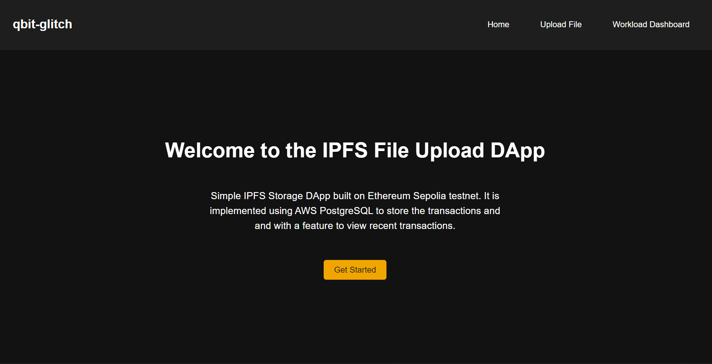
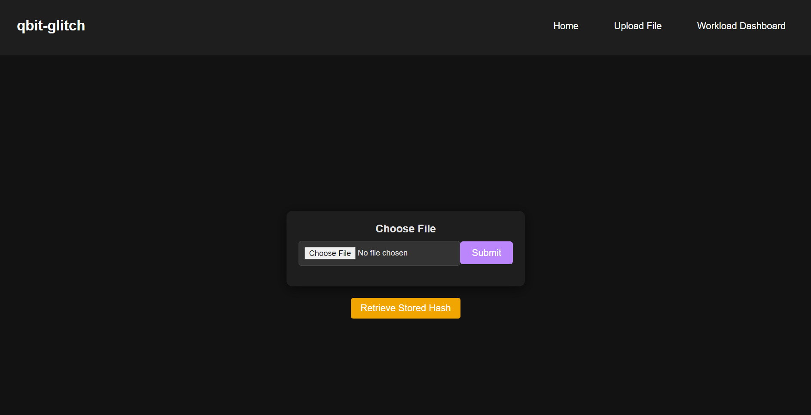
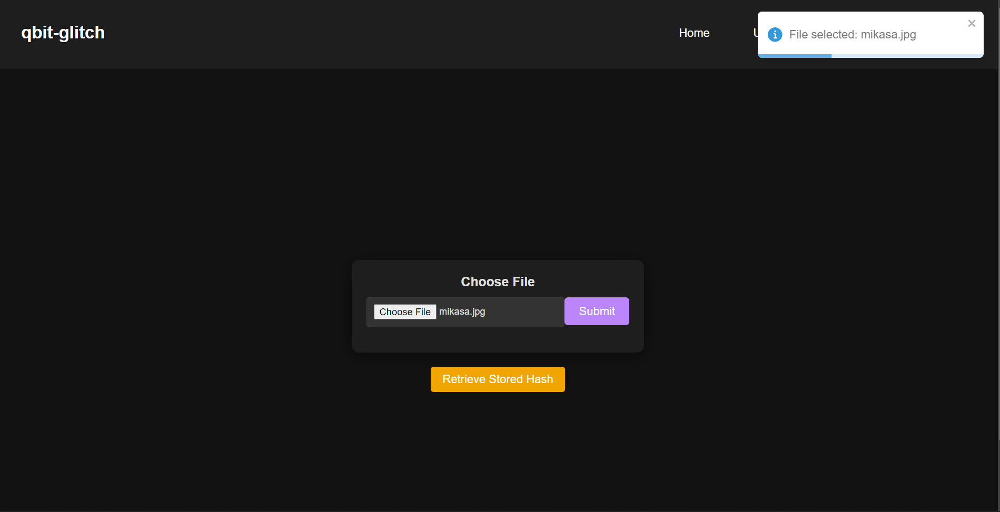
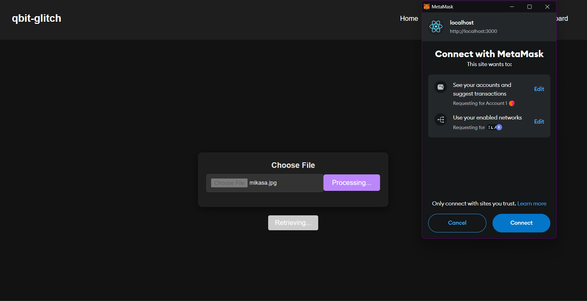
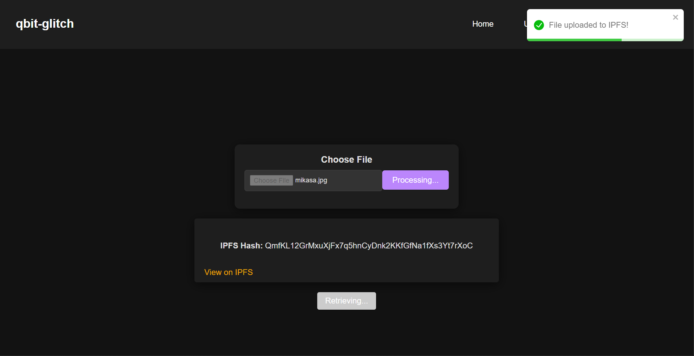
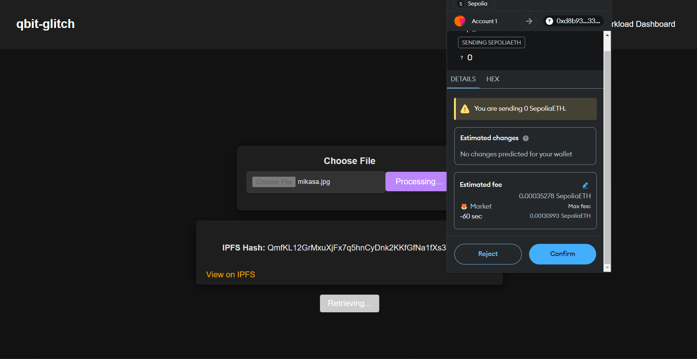
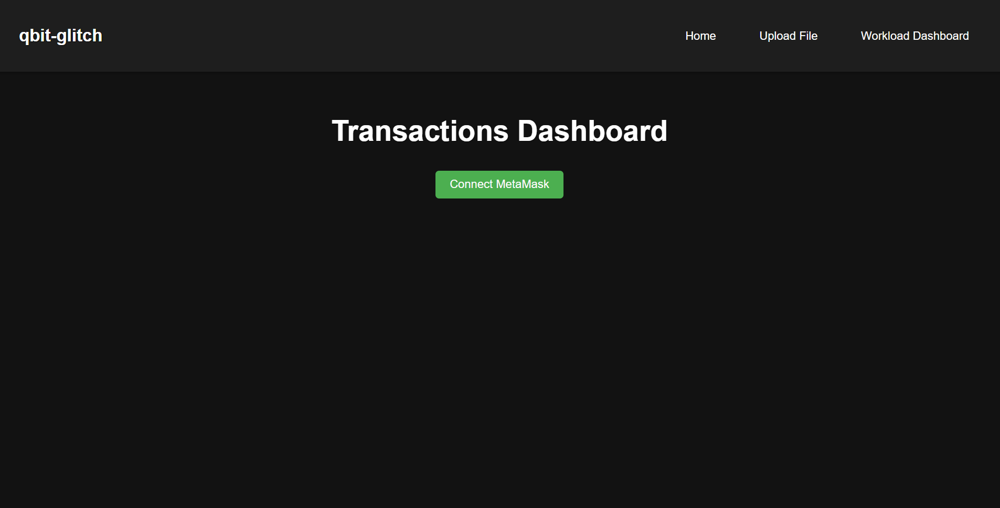
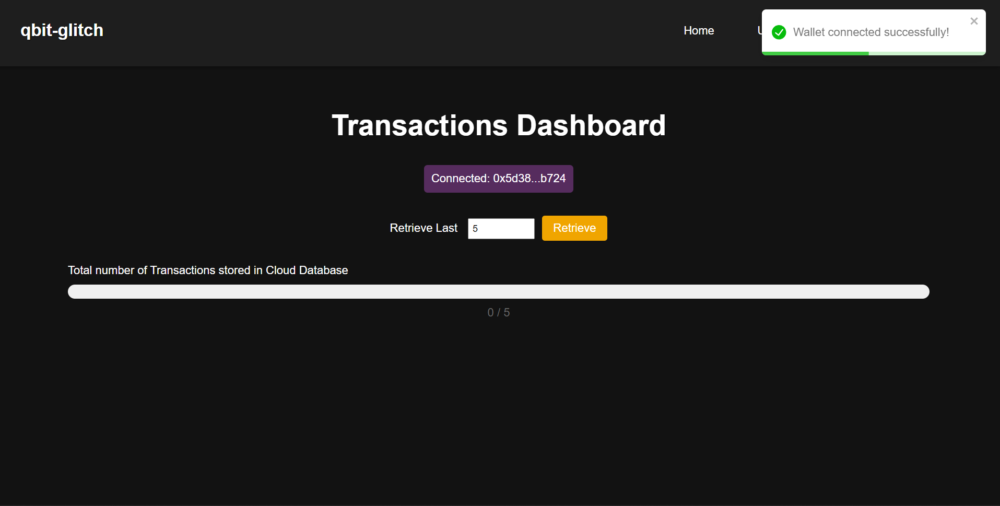
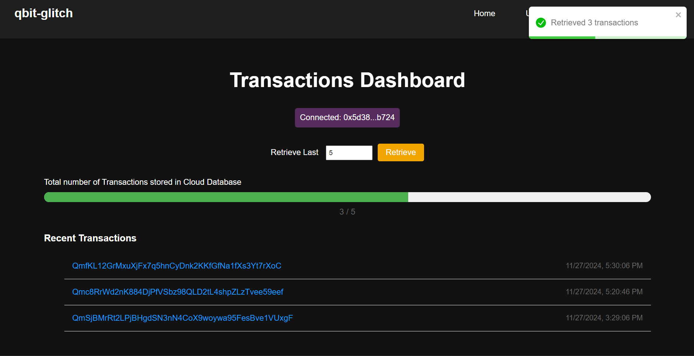

# IPFS File Storage DApp

## Overview

The IPFS File Storage DApp is a decentralized application built on the Ethereum Sepolia testnet, designed for securely uploading and storing files on the InterPlanetary File System (IPFS). This application allows users to upload files, store their corresponding IPFS hashes on the Ethereum blockchain, and view recent transactions. It leverages AWS PostgreSQL for transaction management and provides a user-friendly interface for seamless interaction with the blockchain and IPFS.

## Sample Demo Walkthrough
  
  - Click on `Get Started` or navigate to `Upload File` 

  
  - Choose anyfile stored locally and you will see a pop-up : `File Selected: <File Name>`
  

  - Click On `Submit` button

  
  - `Metamask` will ask for connection and click on the `Connect` button
  
  

  
  - `Metamask` will again ask for confirmation for storing the IPFS hash in the blockchain. Here we have used Sepolia Ethereum Testnet for testing purposes.
  Then wait some time (~10-40 sec) for the hash to be stored in the blockchain. After successfull Storage you will be redirected to the `Home Page`.

  - Navigate to the `Workload Dashboard` to view your own recent transactions. *Note*: You can view only those transactions which are done by that particular `Metamask Account`. You can see the `Total Number of Transactions` which are stored in the database.
  - Navigate to the `Worload Dashboard`
  
   
   - Click on `Connect Metamask` and you will be shown a progress bar which will display the total number of transactions stored on the AWS RDS PostgreSQL database.

   
   - Click on `Retrieve` and write the number of transactions you want to see.

  
  - Click on any transaction hash value and you will be able to see your File which is stored on IPFS.


## Features

- **File Upload**: Users can select and upload files to IPFS, which are then pinned using Pinata.
- **Blockchain Integration**: The IPFS hash of the uploaded file is stored on the Ethereum blockchain, ensuring immutability and security.
- **Transaction Management**: Recent transactions are stored in a PostgreSQL database, allowing users to view their upload history.
- **User Wallet Connection**: Users can connect their MetaMask wallet to interact with the DApp.
- **Responsive Design**: The application is designed to be responsive and user-friendly, providing a smooth experience across devices.

## Technologies Used

- **Frontend**: React.js
- **Blockchain**: Ethereum (Sepolia Testnet)
- **IPFS**: InterPlanetary File System (via Pinata)
- **Backend**: Node.js, Express.js
- **Database**: PostgreSQL
- **Styling**: CSS

## Getting Started

### Prerequisites

Before you begin, ensure you have the following software installed on your machine:

- Node.js (v14 or higher)
- PostgreSQL
- MetaMask extension installed in your browser

### Installation

1. **Clone the repository**:
   ```bash
   git clone https://github.com/qbit-glitch/ipfs-file-storage-dapp
   cd ipfs-file-storage-dapp
   ```

2. **Set up the backend**:
   
   Navigate to the backend folder:
   ```bash
   cd backend
   ```
   
   Install dependencies:
   ```bash
   npm install
   ```
   
   Create a `.env` file in the backend directory and add your `AWS PostgreSQL` credentials and other environment variables:
   ```plaintext
   DB_USER=your_db_user
   DB_PASSWORD=your_db_password
   DB_NAME=your_db_name
   DB_HOST=localhost
   DB_PORT=5432
   REACT_APP_API_URL=http://localhost:3000
   JWT=your_pinata_jwt
   ```

   Start the backend server:
   ```bash
   nodemon index.js
   ```

3. **Set up the frontend**:
   
   Navigate to the original directory (The frontend code is in the orginal directory itself):
   ```bash
   cd <ipfs-file-storage-dapp> {your directory location}
   ```
   
   Install dependencies:
   ```bash
   npm install
   ```

   Start the frontend application:
   ```bash
   npm start
   ```

4. **Connect your MetaMask wallet** to the Sepolia testnet and ensure you have some test Ether for transactions.

### Usage

- Navigate to the home page to get started.
- Click on "Upload File" to select and upload a file.
- After uploading, you can view the IPFS hash and retrieve your stored transactions.

### API Endpoints

- **POST /api/transactions**: Store a new transaction (IPFS hash and address).
- **GET /api/transactions**: Retrieve a list of transactions.
- **GET /api/transactions/count**: Get the total number of transactions.
- **GET /api/health**: Health check endpoint.

## Contributing

Contributions are welcome! If you have suggestions for improvements or features, feel free to fork the repository and submit a pull request.

## License

This project is licensed under the MIT License - see the LICENSE file for details.

## Acknowledgements

- Special thanks to the developers of IPFS and Ethereum for their groundbreaking work in decentralized storage and blockchain technology.
- Thanks to the community for their support and contributions.

## Contact

For any inquiries or feedback, please reach out to quantumsecurebytes@gmail.com.